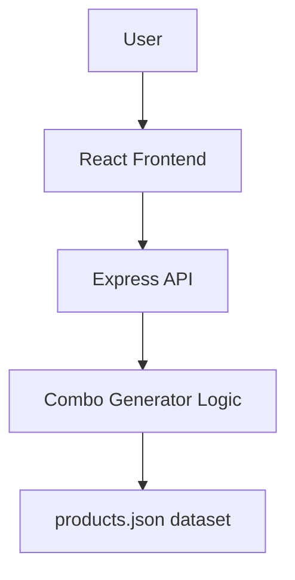

# Lip Combo Generator
A full-stack web application that generates lip combinations from a user's makeup inventory.<br>
The application allows users to select a color family and generate a compatible lip combo consisting of:<br>
- Lip liner
- Lipstick base
- Gloss or balm topper<br>

The project was built as a learning exercise to practice full-stack development and API design.

## **Problem**<br>
Choosing a lip combination from a large makeup collection can be overwhelming. Many users experiment with layering products, but discovering good combinations requires trial and error.
## **Solution**<br>
Lip Combo Generator automatically creates compatible lip combinations based on product attributes such as type and color family.<br>
The application filters products and generates structured combinations consisting of:<br>

liner + base + topper<br>

This allows users to quickly explore possible combinations from their existing inventory.<br>

### **Features:**<br>
- Generate lip combos based on a selected color family
- Randomized liner and topper selection
- Lipstick base matched to the chosen color family
- Structured API responses
- Simple and responsive React UI<br>

### **Dataset**<br>
The project currently uses a static dataset stored in:<br>

server/data/products.json<br>

Current dataset size:<br>
- 65 liners
- 13 crayons
- 30 lipsticks
- 21 glosses
- 6 balms<br>

Total lip products: 135<br>
## **Tech Stack:**<br>
- Frontend: React + Vite + CSS
- Backend: Node.js + Express
- Architecture: REST API + Static JSON dataset 

## **Architecture**<br>
The application follows a simple client-server architecture.<br>

The React frontend handles the UI and sends requests to an Express backend. 

The backend processes the dataset and generates lip combinations based on product attributes.<br>

## Setup

### 1. Clone the repository

```bash
git clone https://github.com/your-username/lip-combo-generator.git
cd lip-combo-generator
```

---

### 2. Install dependencies

Install backend dependencies:

```bash
cd server
npm install
```

Install frontend dependencies:

```bash
cd ../client
npm install
```

---

### 3. Run the backend server

```bash
cd server
node server.js
```

The backend will start on:

```
http://localhost:4000
```

---

### 4. Run the frontend

Open a new terminal and run:

```bash
cd client
npm run dev
```

The frontend will start on:

```
http://localhost:5173
```

---

### 5. Generate lip combos

1. Open the frontend in your browser  
2. Select a **color family**  
3. Click **Generate Combos**

The application will generate a lip combination consisting of:

- liner
- lipstick base
- topper (gloss or balm)

## **Future Improvements** 
Potential future improvements include:<br>
- User inventory management
- Smarter combination algorithm
- Save favorite combos
- Database integration
- Mobile responsive improvements
